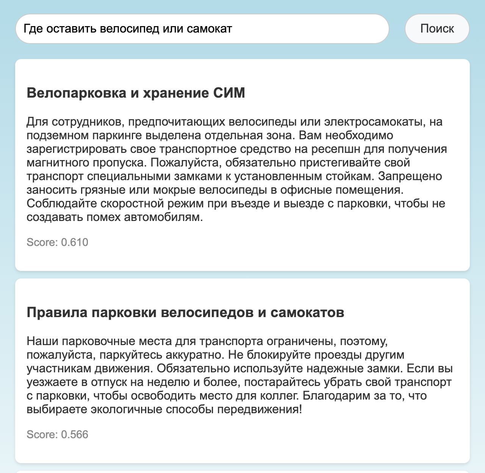

<p align="center">
  Веб-сервис семантического поиска по корпоративной базе знаний. Документы и запросы переводятся в векторы моделью <code>sentence-transformers</code>, поэтому находятся документы, близкие по смыслу, а не по совпадению слов.
</p>

<p align="center">
  
  
  
  
  
  
</p>

<p align="center">
  
</p>

## Возможности

- Поиск по смыслу: на запрос "Где оставить велосипед или самокат" первыми находятся "Велопарковка и хранение СИМ" и "Правила парковки велосипедов и самокатов".
- Выбор модели векторизации: `gemma` (`google/embeddinggemma-300m`, по умолчанию), `rubert` (`cointegrated/rubert-tiny2`) или идентификатор другой модели `sentence-transformers` с Hugging Face.
- Векторы хранятся в базе рядом с документами. Поиск проходит по базе потоково, пачками по 100 записей, и отбирает top-k через min-heap.
- Панель управления `/dashboard`: просмотр, добавление и удаление документов, импорт из JSON-файлов, сброс базы к набору по умолчанию.
- REST API с интерактивной документацией OpenAPI на `/docs`. Изменение базы можно закрыть токеном `ADMIN_TOKEN`.
- База знаний по умолчанию: синтетический набор из 171 корпоративного регламента (`data/data.json`).

## Качество

Оценка на базе по умолчанию: 10 запросов с ручной разметкой релевантных документов (`evaluation/eval.py`, библиотека `ranx`).

| Модель | recall@3 | recall@5 | nDCG@5 | MRR@5 |
| --- | --- | --- | --- | --- |
| `rubert` | 0.783 | 0.867 | 0.835 | 0.875 |

Запуск оценки:

```bash
uv run python -m evaluation.eval --model cointegrated/rubert-tiny2
```

## Установка

Требуется Python 3.13 и [uv](https://docs.astral.sh/uv/).

```bash
git clone https://github.com/TihonSotnikov/Semantic-Search-System.git
cd Semantic-Search-System
uv sync --extra cpu
```

Для NVIDIA GPU вместо `--extra cpu` используется `--extra cu126`.

Модель `gemma` на Hugging Face доступна после принятия лицензии и требует токена в переменной `HF_TOKEN`. Модель `rubert` скачивается без токена.

## Использование

```bash
uv run python -m app.main --model rubert
```

Поиск открывается на http://localhost:8000, панель управления - на http://localhost:8000/dashboard. При первом запуске создается `data.db` и заполняется документами из `data/data.json`; при следующих запусках база сохраняется.

Запрос к API:

```bash
curl -G http://localhost:8000/search --data-urlencode "q=Где оставить велосипед или самокат" -d k=2
```

Ответ (модель `rubert`, тексты сокращены):

```json
[
  {"id": 25, "score": 0.6097, "title": "Велопарковка и хранение СИМ", "text": "Для сотрудников, предпочитающих велосипеды..."},
  {"id": 162, "score": 0.5658, "title": "Правила парковки велосипедов и самокатов", "text": "Наши парковочные места..."}
]
```

### Docker

Образ публикуется в GitHub Container Registry. База, логи и скачанная модель хранятся в томе `/home/sss/storage`.

```bash
docker run -d -p 8000:8000 -e HF_TOKEN=<token> \
    -v sss-storage:/home/sss/storage ghcr.io/tihonsotnikov/semantic-search-system:latest
```

Без токена Hugging Face вместо `-e HF_TOKEN=<token>` передается `-e MODEL_NAME=rubert`.

Сборка образа из исходников (`TORCH_BACKEND=cu126` - вариант с поддержкой GPU):

```bash
docker build -t semantic-search-system .
docker build --build-arg TORCH_BACKEND=cu126 -t semantic-search-system:gpu .
```

## Настройка

| Переменная | Аргумент | По умолчанию | Назначение |
| --- | --- | --- | --- |
| `MODEL_NAME` | `--model` | `gemma` | Модель векторизации |
| `DATABASE_URL` | `--database` | `sqlite+aiosqlite:///data.db` | URL базы для SQLAlchemy (драйверы `aiosqlite`, `asyncpg`) |
| | `--host`, `--port` | `0.0.0.0`, `8000` | Адрес сервера |
| `ADMIN_TOKEN` | | не задан | Токен для изменения базы, передается в заголовке `X-Admin-Token` |
| `DATA_FILE` | | `data/data.json` | Документы по умолчанию |
| `LOG_FILE` | | `app.log` | Файл логов, пустое значение отключает запись в файл |
| `LOGGING` | | `INFO` | Уровень логирования |

## API

| Метод | Путь | Описание |
| --- | --- | --- |
| `GET` | `/search?q=&k=` | Поиск, `k` от 1 до 50 (по умолчанию 3) |
| `GET` | `/documents` | Все документы |
| `POST` | `/documents` | Добавление документа `{"title": ..., "text": ...}` |
| `DELETE` | `/documents/{id}` | Удаление документа |
| `DELETE` | `/documents` | Очистка базы |
| `POST` | `/documents/import` | Импорт JSON-файлов со списком документов |
| `POST` | `/documents/reset` | Сброс базы к документам по умолчанию |
| `GET` | `/health` | Проверка состояния |

Эндпоинты изменения базы требуют `X-Admin-Token`, если задан `ADMIN_TOKEN`. Пример файла для импорта: `data/data_50_docs.json`.

## Тестирование

```bash
uv sync --extra cpu
uv run pytest
uv run ruff check .
```

Тесты API используют детерминированную заглушку вместо модели и не скачивают веса.
